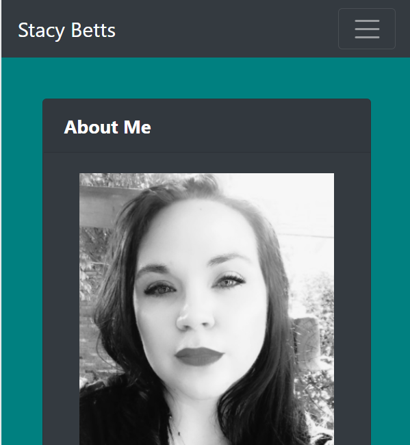
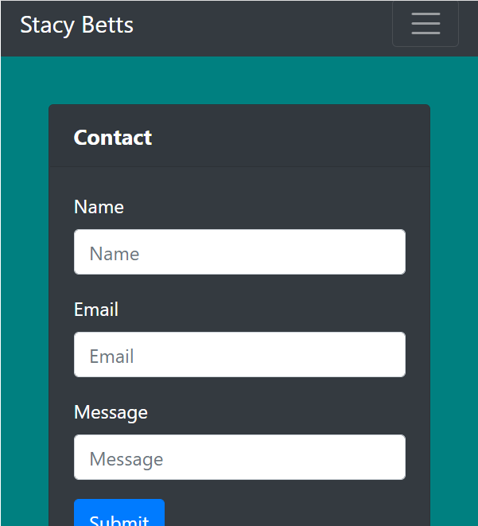
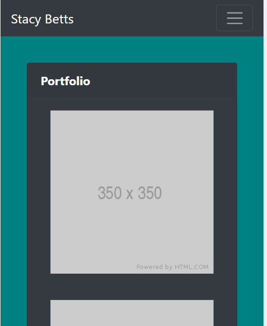
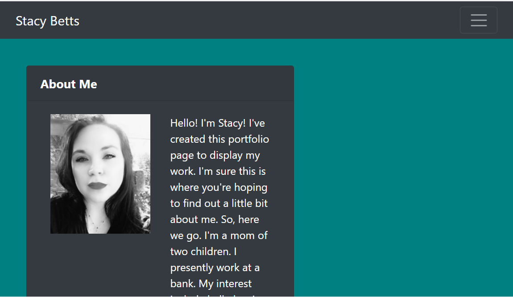
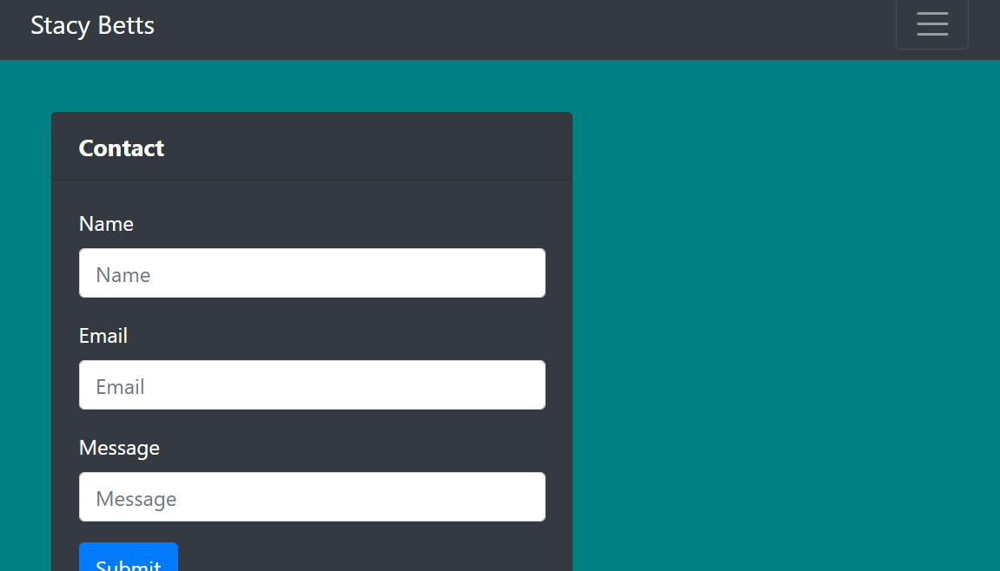
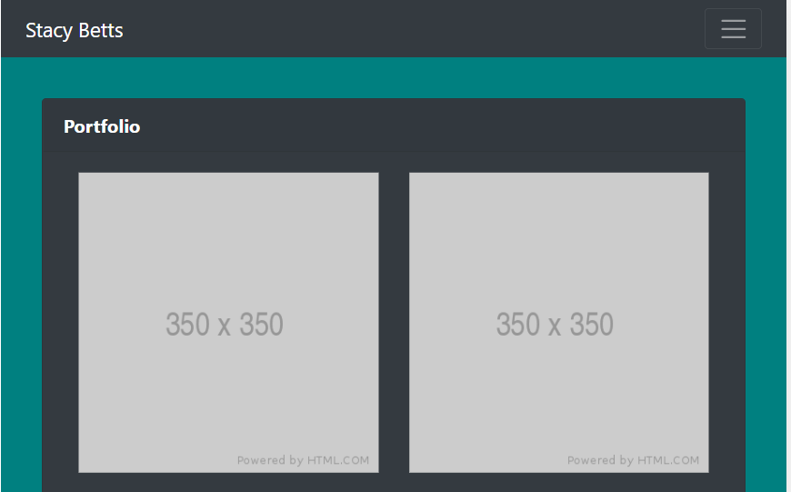
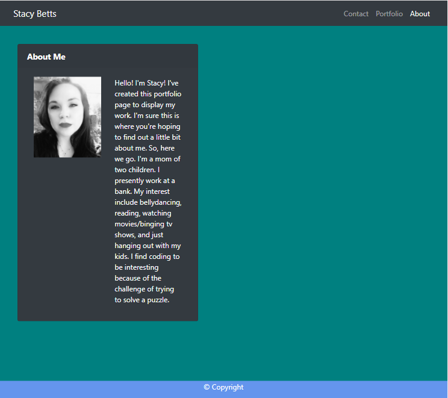
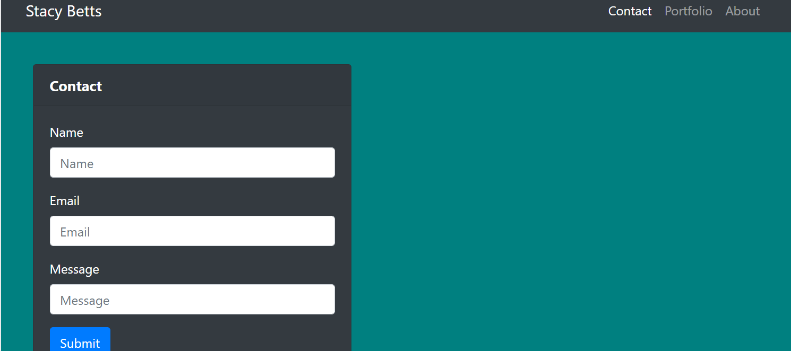
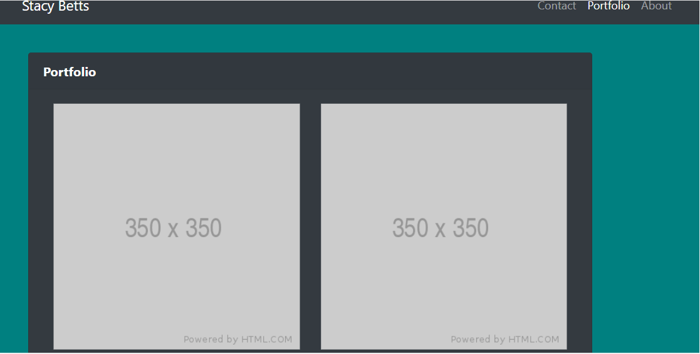

# Portfolio

### Description
* The purpose of this project is to create a portfolio, in which to store future projects. Additionally, the images need to be responsive, meaning that the site looks and functions the same on differing viewports. 

### Screenshots
* At 400px

    * Index/About Page: 

    

    * Contact Page: 

    

    * Portfolio Page

    

* At 768px

    * Index/About Page: 

    

    * Contact Page: 

    

    * Portfolio Page: 

    

* At 992p

     * Index/About Page: 

    

    * Contact Page: 

     

    * Portfolio Page:

     

### Deployed Site

<a href="">